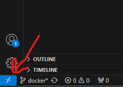
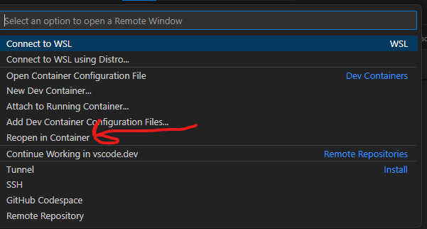

# Backend 
- `npm install`
- `npx prisma migrate dev` to update db
- `npm run start:dev`

# Frontend
- `npm install`
- add .env file that contains backend url EXPO_PUBLIC_SERVER_URL = "http://[ipAddress]:[backend port number]"
- `npm start`

# Docker
1. Download [Docker Desktop](https://www.docker.com/products/docker-desktop/).
2. If you are using windows, after installing, you need to increase the wsl2 memory limit to increase performance, if you have 16gb of ram, do the following:
```
cd %UserProfile%
notepad .wslconfig
```

add the following and save:

```
[wsl2]
memory=12GB
```

3. Restart your computer.

4. Run:
```
docker-compose up --build
``` 
from the taste-buddy directory.
All the containers should be built and started, and the app should now be accessible.

You can access the docker DB in mysql workbench from localhost:3307. Password is "0000"

# Dev Containers
1. Install the dev containers vscode extension
2. click the bottom left and then "re-open in container"





after opening; the whole appliaction will start up; all contians were begin to run.
it may take a while for the appliaction to become accessible because it has to install all node_modules

You will not be able to use the git tab in vscode, as the container is not authenicated with github.
Changes will, however persist to your local system, so you can commit it there.

# Elasticsearch setup through Docker
run:
```
docker-compose up elasticsearch
```

# Kibana
run:
```
docker-compose up kibana
```
Go to http://localhost:5601
